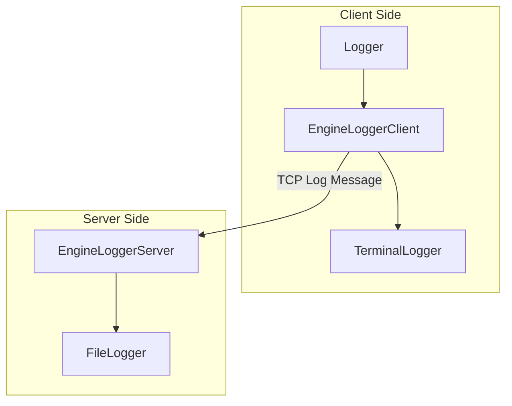

# Logger

Distributed TCP logger for Node.js. Centralizes logs from multiple apps, ensures reliable delivery, queueing, reconnection, and strict formatting. Supports colorized output, file rotation, and global log ordering. Easy integration for microservices.

---

## ⚠️ Client Initialization Required

You **must** call `EngineLoggerClient.InitClientInstance(config, appName)` before using any logger. If you do not call this method, logs will only be printed to the terminal and **will not be sent to the server**.

**Example:**

```typescript
import { EngineLoggerClient } from 'client/EngineLoggerClient';
import { Logger } from 'client/Logger';
import { ConfigConnection } from 'shared/ConfigConnection';

const config: ConfigConnection = { port: 5050, host: '127.0.0.1' };
EngineLoggerClient.InitClientInstance(config, 'MyApp');

const logger = new Logger('MyApp');
logger.info('Application started');
```

If you forget to call `InitClientInstance`, logs will **not** be sent to the server and a warning will be printed in the terminal.


---

## Project Structure Diagram




---

## How to Use


### 1. Start the Log Server

Start the server in your main project:

```typescript
import { EngineLoggerServer } from 'server/EngineLoggerServer';
import { ConfigConnection } from 'shared/ConfigConnection';

const config: ConfigConnection = {
    port: process.env.ENGINE_LOGGER_PORT ? parseInt(process.env.ENGINE_LOGGER_PORT) : 5050,
    host: process.env.ENGINE_LOGGER_HOST || '127.0.0.1'
};

const server = new EngineLoggerServer();
server.startServer(config);
```


### 2. Use the Log Client

In your microservice or application, use the client to send logs:

```typescript
import { EngineLoggerClient } from 'client/EngineLoggerClient';
import { Logger } from 'client/Logger';
import { ConfigConnection } from 'shared/ConfigConnection';

const config: ConfigConnection = { port: 5050, host: '127.0.0.1' };
EngineLoggerClient.InitClientInstance(config, 'MyApp');

const logger = new Logger('MyApp');
logger.info('Application started');
logger.error('An error occurred');
logger.warn('Warning!');
logger.debug('Debugging...');
```


#### Multiple Logger Contexts

You can create multiple instances of the `Logger` class, each with its own context. This allows you to tag logs with the specific context or module where they were generated, making it easier to trace the origin of each log message.

```typescript
const userLogger = new Logger('UserModule');
const paymentLogger = new Logger('PaymentModule');

userLogger.info('User created');
paymentLogger.error('Payment failed');
```

Each log will include its context, helping you identify where in your application the log was produced.


### 3. Configuration

- Use the `ConfigConnection` type to pass host and port to both client and server.
- You can set environment variables `ENGINE_LOGGER_PORT` and `ENGINE_LOGGER_HOST` for dynamic configuration.
- Logs are displayed in the terminal and also saved in daily files in the `logs/` folder.

---

## Public API Documentation

### Logger (Client Side)

- `constructor(context: string)`: Creates a logger for a specific context/module.
- `info(msg: string)`: Logs an info message.
- `error(msg: string)`: Logs an error message.
- `warn(msg: string)`: Logs a warning message.
- `debug(msg: string)`: Logs a debug message (only in non-production environments).

### EngineLoggerClient (Client Side)

- `static InitClientInstance(config: ConfigConnection, appName: string)`: Initializes the client singleton and connects to the server.
- `static GetInstance()`: Returns the singleton instance. If not initialized, logs only print to terminal.
- `info(context: string, message: string)`: Sends info log to server and terminal.
- `error(context: string, message: string)`: Sends error log to server and terminal.
- `warn(context: string, message: string)`: Sends warning log to server and terminal.
- `debug(context: string, message: string)`: Sends debug log to server and terminal (only in non-production).

### EngineLoggerServer (Server Side)

- `startServer(config: ConfigConnection)`: Starts the TCP log server on the specified host/port.

### TerminalLogger (Shared)

- `info(date, context, msg)`, `error(date, context, msg)`, `warn(date, context, msg)`, `debug(date, context, msg)`: Prints colorized logs to the terminal. Debug logs are disabled in production.

### FileLogger (Shared)

- `constructor(logDir: string)`: Sets the log directory.
- `writeLog(index, date, level, app, context, message)`: Writes a log entry to the daily log file.

---

## Best Practices

- Always call `EngineLoggerClient.InitClientInstance` before logging.
- Use different logger contexts for different modules.
- Debug logs are automatically disabled in production (`NODE_ENV=production`).
- Use as an npm module by importing from the main entry points.

---

## License

MIT
